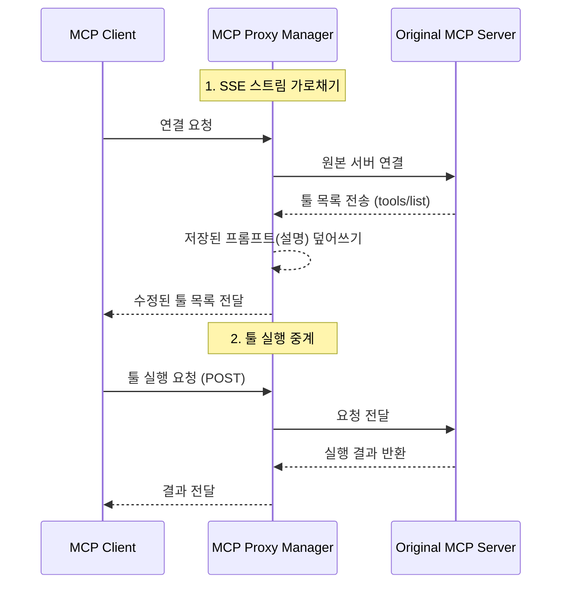

# MCP Proxy Manager

Model Context Protocol (MCP)을 위한 경량 프록시 서버입니다.

MCP 클라이언트(Claude Desktop, Cursor 등)와 실제 MCP 서버 사이에 위치하여 작동합니다. 대시보드를 통해 실시간으로 툴 정의를 확인하고 **설명(프롬프트)을 즉시 수정**할 수 있습니다. 백엔드 재시작이나 코드 수정이 필요 없습니다.

툴 프롬프트 엔지니어링이나 LLM 상호작용 디버깅에 유용합니다.

## 시작하기 (Quick Start)

1. **원본 MCP 서버 실행** (예: 8080 포트).

2. **프록시 실행**:
   ```bash
   # 기본값: http://localhost:8080/sse 로 연결
   npm run dev

   # 다른 URL 지정 시
   ORIGINAL_MCP_URL=http://localhost:9000/sse npm run dev
   ```

3. **대시보드 접속**:
   `http://localhost:3000/dashboard` 로 이동하세요. 서버의 툴 목록이 보이며, 여기서 설명을 수정할 수 있습니다.

4. **클라이언트 연결**:
   MCP 클라이언트(Claude/Cursor) 설정에서 원본 서버 대신 프록시 주소를 입력하세요:
   
   `http://localhost:3000/api/mcp/v1/sse`

## 작동 원리



*   **탐색 (Discovery)**: SSE 스트림을 가로챕니다. 서버가 `tools/list` 결과를 보낼 때, 대시보드에서 저장한 수정(override) 사항을 주입하여 클라이언트에 전달합니다.
*   **실행 (Execution)**: 엔드포인트 주소를 자동으로 재작성합니다. 클라이언트가 툴을 실행하면 요청이 프록시를 거쳐 원본 서버로 투명하게 전달됩니다.

## 기술 스택

*   Next.js 15 (App Router)
*   Tailwind CSS
*   Model Context Protocol SDK
